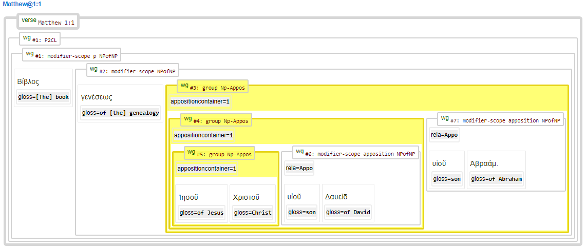

<a href="../transcription.md">Transcription</a> | <a href="README.md#start">Features</a> | <a href="../viewtypes.md#start">Viewtypes</a> | <a href="../textformats.md#start">Textformats</a> |  <a href="../syntaxtrees.md#start">Syntaxtrees</a> | <a href="../../tutorial/README.md#start">Tutorial</a> | <a href="../usecases/README.md#start">Usecases</a> | <a href="../about.md#start">About</a>

# Nestle 1904 GNT -  Feature: appositioncontainer

Feature group | Feature type | Data type | Available for node types | Used by viewtypes
---  | --- | --- | --- | ---
[`Syntactic`](featuresbygroup.md#syntactic-features) | [`Node`](featuresbyfeaturetype.md#node-features) | [`Integer`](featuresbydatatype.md#integer-datatype) | [`wg`](featuresbynodetype.md#wordgroup-nodes) [`phrase`](featuresbynodetype.md#phrase-nodes) [`subphrase`](featuresbynodetype.md#subphrase-nodes) | [`syntax-view`](../syntax-view.md#start) [`wg-view`](../wg-view.md#start) 

## Feature description 

The `appositioncontainer` feature indicates whether a word group or phrase contains an apposition. An apposition is a grammatical construction where two elements, typically noun phrases, are placed side by side, with one element serving to define or modify the other.

## Feature values 

Frequency for nodetype [`wg`](featuresbynodetype.md#wordgroup-nodes) (used in [`wg-view`](../wg-view.md#start)):

Value | Description | Frequency
---  | --- | --- 
&lt;no value&gt; | This word group contains no appositioncontainer | -
`1` | This word group contains an appositioncontainer | 1908

Frequency for nodetype [`phrase`](featuresbynodetype.md#phrase-nodes) (used in [`syntax-view`](../syntactic-view.md#start)):

Value | Description | Frequency
---  | --- | --- 
&lt;no value&gt; | This phrase contains no appositioncontainer | -
`1` | This phrase contains an appositioncontainer | 715

Frequency for nodetype [`subphrase`](featuresbynodetype.md#subphrase-nodes) (used in [`syntax-view`](../syntactic-view.md#start)):

Value | Description | Frequency
---  | --- | --- 
&lt;no value&gt; | This subphrase contains no appositioncontainer | -
`1` | This subphrase contains an appositioncontainer | 1908

## Note

The following image presents a nested apposition demonstrating this feature and the related feature [rela](rela.md#readme).

## Source description

This feature is derived from the (optional) XML attribute `appositioncontainer` of tag `wg` (wordgroup).

---
#### *Browse all features by [name](featuresbyname.md#start), [node type](featuresbynodetype.md#start), [data type](featuresbydatatype.md#start), [feature group](featuresbygroup.md#start) or [feature type](featuresbyfeaturetype.md#start).*
