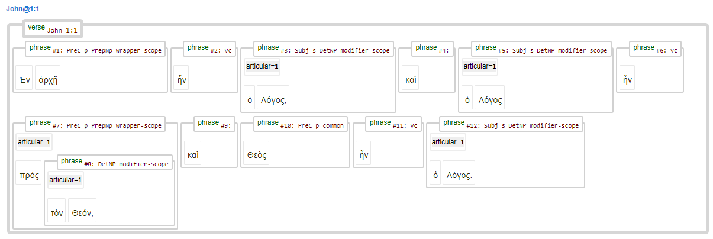

<a name="start"></a>
<div class="hidden-content">
<a href="../transcription.md">Transcription</a> | <a href="README.md#start">Features</a> | <a href="../viewtypes.md#start">Viewtypes</a> | <a href="../textformats.md#start">Textformats</a> |  <a href="../syntaxtrees.md#start">Syntaxtrees</a> | <a href="../../tutorial/README.md#start">Tutorial</a> | <a href="../usecases/README.md#start">Usecases</a> | <a href="../about.md#start">About</a>
</div>

# Nestle 1904 GNT - Feature: articular

Feature group | Feature type | Data type | Available for node types | Used by viewtype
---  | --- | --- | --- |---
[`Syntactic`](featuresbygroup.md#syntactic-features) | [`Node`](featuresbyfeaturetype.md#node-features) | [`Integer`](featuresbydatatype.md#integer-datatype) | [`sentence`](featuresbynodetype.md#sentence-nodes) [`group`](featuresbynodetype.md#group-nodes)  [`wg`](featuresbynodetype.md#wordgroup-nodes) [`clause`](featuresbynodetype.md#clause-nodes) [`phrase`](featuresbynodetype.md#phrase-nodes) [`subphrase`](featuresbynodetype.md#subphrase-nodes) | [`syntax-view`](../syntax-view.md#start) [`wg-view`](../wg-view.md#start)

## Feature description 

The `articular` feature indicates whether a syntactic unit (such as a sentence, group, clause, phrase, or subphrase) contains an article.

## Feature values 

For [`sentence`](featuresbynodetype.md#sentence-nodes) nodes (used in [`syntax-view`](../syntax-view.md#start) and  [`wg-view`](../wg-view.md#start)):

value | description | Frequency
---  | --- | --- 
&lt;empty&gt; | No articular in sentence | -
`1` | Articular in sentence | 2619

For [`group`](featuresbynodetype.md#group-nodes) nodes (used in [`syntax-view`](../syntax-view.md#start)):

value | description | Frequency
---  | --- | --- 
&lt;empty&gt; | No articular in group | -
`1` | Articular in group | 187

For [`clause`](featuresbynodetype.md#clause-nodes) nodes (used in [`syntax-view`](../syntax-view.md#start)):

value | description | Frequency
---  | --- | --- 
&lt;empty&gt; | No articular in clause | -
`1` | Articular in clause | 973

For [`wg`](featuresbynodetype.md#wordgroup-nodes) nodes (used in [`wg-view`](../wg-view.md#start)):

value | description | Frequency
---  | --- | --- 
&lt;empty&gt; | No articular in wordgroup | -
`1` | Articular in wordgroup | 28772

For [`phrase`](featuresbynodetype.md#phrase-nodes) nodes (used in [`syntax-view`](../syntax-view.md#start)):
value | description | Frequency
---  | --- | --- 
&lt;empty&gt; | No articular in phrase | -
`1` | Articular in phrase | 13079

For [`subphrase`](featuresbynodetype.md#subphrase-nodes) nodes (used in [`syntax-view`](../syntax-view.md#start)):

value | description | Frequency
---  | --- | --- 
&lt;empty&gt; | No articular in subphrase | -
`1` | Articular in subphrase | 24993

## Notes

This feature functions as a pseudo-boolean variable. To find all sentence without any article, use the following snippet:

```python
Query = '''
sentence 
   articular#1
'''
Results = A.search(Query)
```
Replace the expression '#1' with '=1' to find all sentences with an article.

The following example from John 1:1 demonstrates the function of this feature.



## Source description

This feature is derived from the (optional) XML attribute `articular` of tag `wg` (wordgroup).

---
#### *Browse all features by [name](featuresbyname.md#start), [node type](featuresbynodetype.md#start), [data type](featuresbydatatype.md#start), [feature group](featuresbygroup.md#start) or [feature type](featuresbyfeaturetype.md#start).*
