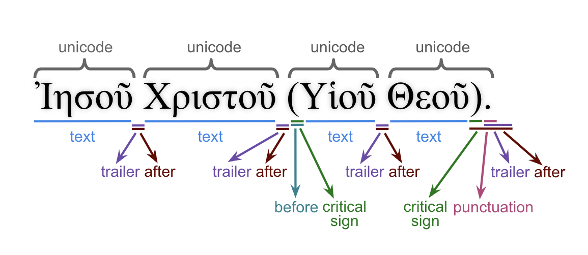

<a href="../transcription.md">Transcription</a> | <a href="README.md#start">Features</a> | <a href="../viewtypes.md#start">Viewtypes</a> | <a href="../textformats.md#start">Textformats</a> |  <a href="../syntaxtrees.md#start">Syntaxtrees</a> | <a href="../../tutorial/README.md#start">Tutorial</a> | <a href="../usecases/README.md#start">Usecases</a> | <a href="../about.md#start">About</a>

# Nestle 1904 GNT -  Feature: before

Feature group | Feature type | Data type | Available for node types | Used by viewtypes
---  | --- | --- | --- | ---
[`Orthograpic`](featuresbygroup.md#orthograpic-features) | [`Node`](featuresbyfeaturetype.md#node-features) | [`string`](featuresbydatatype.md#string-datatype) | [`word`](featuresbynodetype.md#word-nodes) [`subphrase`](featuresbynodetype.md#subphrase-nodes) [`phrase`](featuresbynodetype.md#phrase-nodes) | [`syntax-view`](../syntax-view.md#start) [`wg-view`](../wg-view.md#start)

## Feature description 

The `before` feature includes all material found before a word, such as punctuation marks and special characters.

This feature is also populated for `phrase` or `subphrase`, but only if they consist of just one `word` node.

## Feature values 

For [`word`](featuresbynodetype.md#word-nodes) nodes (used in [`syntax-view`](../syntax-view.md#start) and  [`wg-view`](../wg-view.md#start)):
Value | Description | Unicode codepoint | Frequency
--- |  --- | --- | ---
`—` | Em Dash | [`&#8212`](https://www.codetable.net/decimal/8212) | 16
`(` |	Left Parenthesis | [`&#40`](https://www.codetable.net/decimal/40)| 10
`[[` | Left Square Bracket (2x) | [`&#91`](https://www.codetable.net/decimal/91) (2x) | 7
`[` |	Left Square Bracket | [`&#91`](https://www.codetable.net/decimal/91) | 1

For [`subphrase`](featuresbynodetype.md#subphrase-nodes) nodes (used in [`syntax-view`](../syntax-view.md#start)):
Value | Description | Unicode codepoint | Frequency
--- |  --- | --- | ---
`—` | Em Dash | [`&#8212`](https://www.codetable.net/decimal/8212) | 16
`(` |	Left Parenthesis | [`&#40`](https://www.codetable.net/decimal/40)| 10
`[[` | Left Square Bracket (2x) | [`&#91`](https://www.codetable.net/decimal/91) (2x) | 7
`[` |	Left Square Bracket | [`&#91`](https://www.codetable.net/decimal/91) | 1

For [`phrase`](featuresbynodetype.md#phrase-nodes) nodes (used in [`syntax-view`](../syntax-view.md#start)):
Value | Description | Unicode codepoint | Frequency
--- |  --- | --- | ---
`—` | Em Dash | [`&#8212`](https://www.codetable.net/decimal/8212) | 8
`(` |	Left Parenthesis | [`&#40`](https://www.codetable.net/decimal/40)| 6
`[[` | Left Square Bracket (2x) | [`&#91`](https://www.codetable.net/decimal/91) (2x) | 2

## Notes

See also the following related features:
   * [after](after.md#start): All material found after a word.
   * [criticalsign](criticalsign.md#start): Text-critical signs.
   * [punctuation](punctuation.md#start): Punctuations found after a word.
   * [text](text.md#start): Word without punctuations and text-critical signs.
   * [translit](translit.md#start): Transliteration of the word surface texts.
   * [unaccent](unaccent.md#start): word without accents and diacritical markers.
   * [unicode](unicode.md#start): Unicode presentation including all material before and after word.

The following image shows the relation between these features.

The following [text-formating options](../textformats.md#start) are defined in this dataset using this feature:
<pre>
  A.showFormats()
     format              level    template
     lex-orig-plain      word     {lemma}{punctuation}
     lex-translit-plain  word     {lextranslit}{punctuation}
     text-orig-full      word     {before}{text}{after}
     text-orig-plain     word     {text}{punctuation}
     text-translit-plain word     {translit}{punctuation}
     text-unaccent-plain word     {unaccent}{punctuation}
</pre>

## Source description

The `before` feature is determined from the value of the XML tag `w` (word).

---
##### *Browse all features by [node type](featuresbynodetype.md#start), [data type](featuresbydatatype.md#start), [feature group](featuresbygroup.md#start) or [feature type](featuresbyfeaturetype.md#start).*

