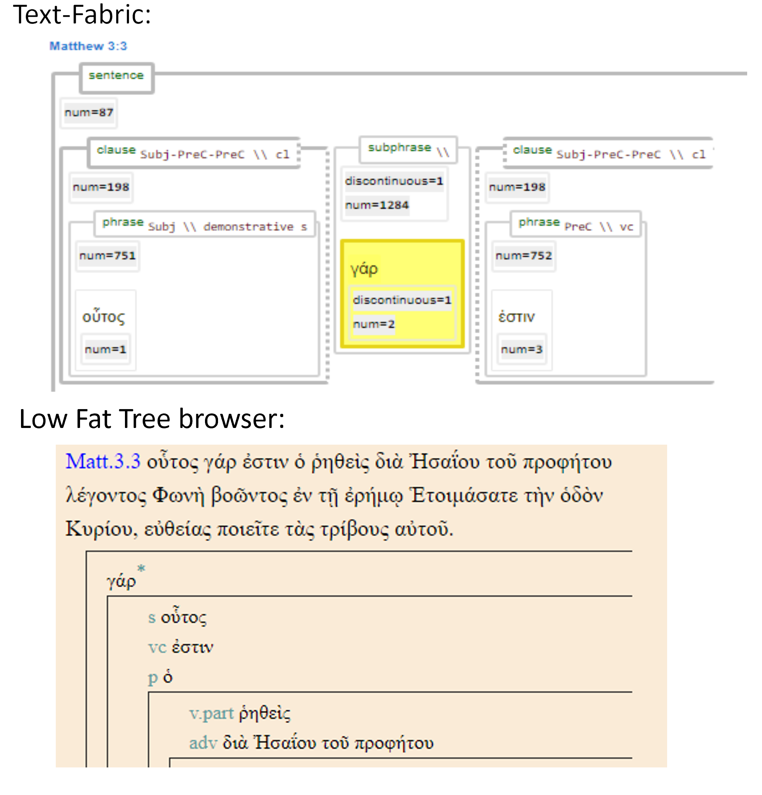

<a name="start"></a>
<div class="hidden-content">
<a href="../transcription.md">Transcription</a> | <a href="README.md#start">Features</a> | <a href="../viewtypes.md#start">Viewtypes</a> | <a href="../textformats.md#start">Textformats</a> |  <a href="../syntaxtrees.md#start">Syntaxtrees</a> | <a href="../../tutorial/README.md#start">Tutorial</a> | <a href="../usecases/README.md#start">Usecases</a> | <a href="../about.md#start">About</a>
</div>

# Nestle 1904 GNT - Feature: discontinuous

Feature group | Feature type | Data type | Available for node types | Used by viewtypes
---  | --- | --- | --- | ---
[`Syntactic`](featuresbygroup.md#syntactic-features) | [`Node`](featuresbyfeaturetype.md#node-features) | [`Integer`](featuresbydatatype.md#integer-datatype) | [`word`](featuresbynodetype.md#word-nodes)  [`subphrase`](featuresbynodetype.md#subphrase-nodes)  [`phrase`](featuresbynodetype.md#phrase-nodes) | [`syntax-view`](../syntax-view.md#start) [`wg-view`](../wg-view.md#start) 

## Feature description 

The `discontinuous` feature is set to `1` if the word is out of sequence in the XML source data in relation to the running text. This feature helps identify words that are repositioned due to the limitations of XML structure, which cannot accommodate overlapping structures.

This feature is also populated for `phrase` or `subphrase`, but only if they consist of just one `word` node.

## Feature values 

Frequency for nodetype [`word`](featuresbynodetype.md#word-nodes) (used in [`wg-view`](../wg-view.md#start) and [`syntax-view`](../syntactic-view.md#start)):

value | description | Frequency
---  | --- | --- 
&lt;empty&gt; | No discontinuation of this word node | -
`1` |  Discontinuation of this word node| 6034

Frequency for nodetype [`subphrase`](featuresbynodetype.md#subphrase-nodes) (used in [`syntax-view`](../syntactic-view.md#start)):

value | description | Frequency
---  | --- | --- 
&lt;empty&gt; | No discontinuation of this subphrase node | -
`1` |  Discontinuation of this subphrase node| 6034

Frequency for nodetype [`phrase`](featuresbynodetype.md#phrase-nodes) (used in [`syntax-view`](../syntactic-view.md#start)):

value | description | Frequency
---  | --- | --- 
&lt;empty&gt; | No discontinuation of this phrase node | -
`1` |  Discontinuation of this phrase node | 645

## Notes

This feature functions as a pseudo-boolean variable. To find all phrases without a discontinues words (i.e. phrases that do not contain postpositive conjunctions), use the following snippet:

```python
Query = '''
phrase 
   discontinuous#1
'''
Results = A.search(Query)
```

Replace the expression '#1' with '=1' to find all phrased that do containing postpositive conjunctions.

In Ancient Greek, postpositive conjunctions such as δέ and γάρ commonly occupy the second position in a clause or subclause, immediately following the first significant word. This syntactic placement not only organizes the structure of sentences but also subtly influences the meaning and rhythm of the text. Given that the source data was represented using an XML file structure, which cannot accommodate overlapping structures, these conjunctions had to be repositioned in the LowFat tree representation.

The following image compares the handling of these postpositive conjunctions in Text-Fabric and the [Lowfat Syntax Tree Browser](https://ibiblio.org/bgreek/resources/syntax-trees/reader/). Note the asterisk behind the γάρ in the Lowfat Syntax Tree Browser, indicating this word is out of sequence in respect to the surface text.



## Source description

This feature is derived from the optional XML attribute `discontinuous` of the tag `w` (word).

---
#### *Browse all features by [name](featuresbyname.md#start), [node type](featuresbynodetype.md#start), [data type](featuresbydatatype.md#start), [feature group](featuresbygroup.md#start) or [feature type](featuresbyfeaturetype.md#start).*
