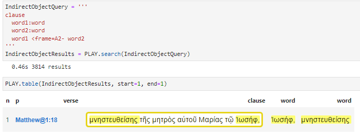
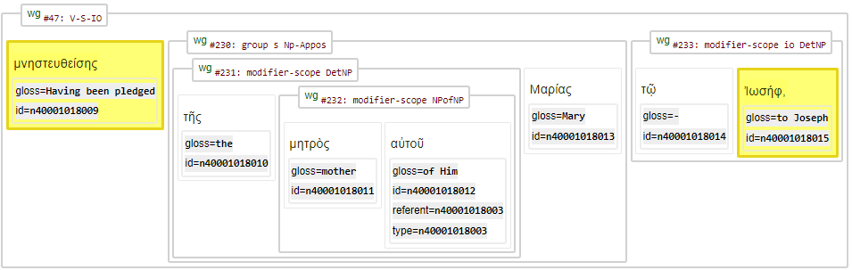

[`Transcription`](../transcription.md#start) | [`Features`](README.md#start) | [`Viewtypes`](../viewtypes.md#start) | [`Textformats`](../textformats.md#start) |  [`Syntaxtrees`](../syntaxtrees.md#start) | [`Tutorial`](../../tutorial/README.md#start) | [`Usecases`](../usecases/README.md#start) | [`About`](../about.md#start)

# Nestle 1904 GNT - Feature: frame

Feature group | Feature type | Data type | Available for node types | Used by viewtypes
---  | --- | --- | --- | ---
[`Semantic`](featuresbygroup.md#semantic-features) | [`Edge`](featuresbyfeaturetype.md#edge-features) | [`string`](featuresbydatatype.md#string-datatype)  |  [`word`](featuresbynodetype.md#word-nodes) | [`syntax-view`](../syntax-view.md#start) [`wg-view`](../wg-view.md#start) 

## Feature description

The `frame` feature provides semantic role labeling (SRL) information, answering the question "Who does what to whom?" in the Nestle 1904 Greek New Testament.

This feature is essential for understanding the semantic relationships within sentences.

## Feature values:

Value | Description | Frequency
---|---|---
A0 | Agent or subject of the action | 25654
A1 | Direct object or the entity directly affected by the action | 15570
A2 | Indirect object or secondary entity affected by the action | 2577
AA2 | Adverbial roles in a sentence | 92

## Note

The following image shows a query that will return the node IDs of the verb and its indirect object:

The following image shows the first returned clause (from Matthew 1:18):

Edges can be traversed in both directions. For more details, see the [TF documentation on edgefeatures](https://annotation.github.io/text-fabric/tf/core/edgefeature.html).

See also related node feature [framespec](framespec.md#start).

## Source description

The `frame` feature is based on the optional XML attribute `frame` of the `w` (word) tag.

---
###### *Browse all features by [node type](featuresbynodetype.md#start), [data type](featuresbydatatype.md#start), [feature group](featuresbygroup.md#start) or [feature type](featuresbyfeaturetype.md#start).*
