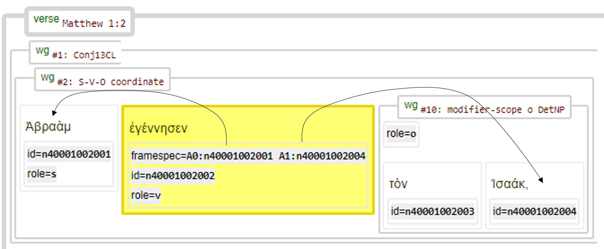
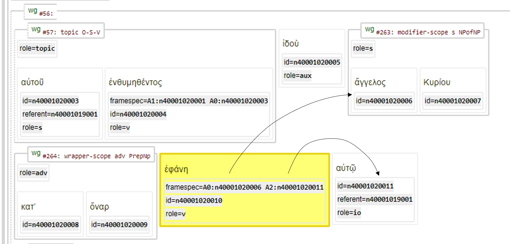

<a name="start"></a>
<div class="hidden-content">
<a href="../transcription.md">Transcription</a> | <a href="README.md#start">Features</a> | <a href="../viewtypes.md#start">Viewtypes</a> | <a href="../textformats.md#start">Textformats</a> |  <a href="../syntaxtrees.md#start">Syntaxtrees</a> | <a href="../../tutorial/README.md#start">Tutorial</a>  | <a href="../about.md#start">About</a>
</div>

# Nestle 1904 GNT - Feature: framespec

Feature group | Feature type | Data type | Available for node types | Used by viewtypes
---  | --- | --- | --- | ---
[`Semantic`](featuresbygroup.md#semantic-features) | [`Node`](featuresbyfeaturetype.md#node-features) | [`String`](featuresbydatatype.md#string-datatype) | [`word`](featuresbynodetype.md#word-nodes) [`subphrase`](featuresbynodetype.md#subphrase-nodes) [`phrase`](featuresbynodetype.md#phrase-nodes) | [`syntax-view`](../syntax-view.md#start) [`wg-view`](../wg-view.md#start) 

## Feature description

The `framespec` feature provides references to the [id](id.md#start) of the subject, object, or indirect object. This feature is populated primarily for verbs (24690 out of 24767 occurrences), with a few references for other word types. Its functional equivalent edge feature is [frame](frame.md#start).

This feature is also populated for `phrase` or `subphrase`, but only if they consist of just one `word` node.

## Feature values

This feature contains one or more references to [`id`](id.md#start)'s,  like in following example:

```
A0:n63001005005;n63001001007 A1:n63001010014
```
The labels can be decoded using the following table.

Value | Description | Frequency
---|---|---
A0 | Agent or subject of the action | 25654
A1 | Direct object or the entity directly affected by the action | 15570
A2 | Indirect object or secondary entity affected by the action | 2577
AA2 | Adverbial roles in a sentence | 92

The values behind these identifiers are in the following format:

```
An 'n' followed by a 11-digit unique id in the format
    BBCCCVVVWWW
    BB          => zero-padded book, NT starts at 40
      CCC       => zero-padded chapter
         VVV    => zero-padded verse
            WWW => zero-padded word index (instance within the verse)
```

## Notes

The following syntactical graphs from Matthew 1:2 and 1:20 serve as demonstration of this feature:




See also the following related features:
   * [frame](frame.md#start): Edge feature that links nodes that are part of the frame; labelled as A0, A1 etc.
   * [id](id.md#start): A uniqe identifier for each individual word in the corpus.
   * [referent](referent.md#start): Edge feature providing referent entity to which the current node refers.
   * [subjrefspec](subjrefspec.md#start): Node feature providing referent entity to which the current node refers.

## Source description

This feature is derived from the (optional) XML attribute `frame` of the tag `w` (word). Annotation data originates from [Clear Bible](https://github.com/Clear-Bible/macula-greek/tree/main/sources/Clear/annotations).

---
#### *Browse all features by [name](featuresbyname.md#start), [node type](featuresbynodetype.md#start), [data type](featuresbydatatype.md#start), [feature group](featuresbygroup.md#start) or [feature type](featuresbyfeaturetype.md#start).*
