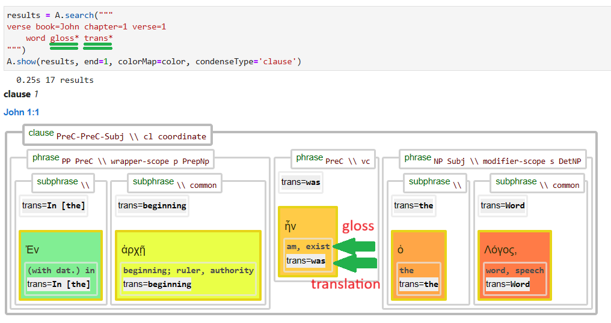

[`Transcription`](../transcription.md#start) | [`Features`](README.md#start) | [`Viewtypes`](../viewtypes.md#start) | [`Textformats`](../textformats.md#start) |  [`Syntaxtrees`](../syntaxtrees.md#start) | [`Tutorial`](../../tutorial/README.md#start) | [`Usecases`](../usecases/README.md#start) | [`About`](../about.md#start)

# Nestle 1904 GNT - Feature: gloss

Feature group | Feature type | Data type | Available for node types | Used by viewtypes
---  | --- | --- | --- | ---
[`Lexical`](featuresbygroup.md#lexical-features) | [`Node`](featuresbyfeaturetype.md#node-features) | [`string`](featuresbydatatype.md#string-datatype)  | [`word`](featuresbynodetype.md#word-nodes)  | [`syntax-view`](../syntax-view.md#start) [`wg-view`](../wg-view.md#start) 

## Feature description

This feature provides an English gloss for each Greek word, as per the Biblical Greek Vocabulary Builder (BGVB).

## Feature values

Frequency for nodetype [word](featuresbynodetype.md#word-nodes

Value|Occurences
---|---
the|19783
and, also, likewise|8978
he, she, it, himself, herself, itself; even, very; same|5550
you|2892
but, and|2787
(with dat.) in|2743
I|2567
am, exist|2457
say, tell|2255
no, not|1622

## Note

See also the related feature [trans](trans.md#start) wich contains the text from the [Berean Interlinear Bible](https://berean.bible/) for this Greek word. The following image shows their relation:

## Source description

The `gloss` feature is based on information from the Biblical Greek Vocabulary Builder (BGVB), developed by Oliver Glanz using Bible OL data.

---
###### *Browse all features by [node type](featuresbynodetype.md#start), [data type](featuresbydatatype.md#start), [feature group](featuresbygroup.md#start) or [feature type](featuresbyfeaturetype.md#start).*
