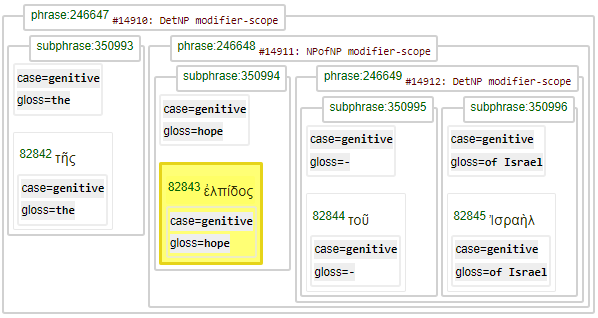
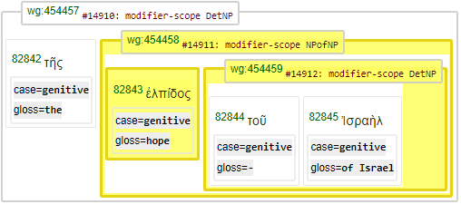
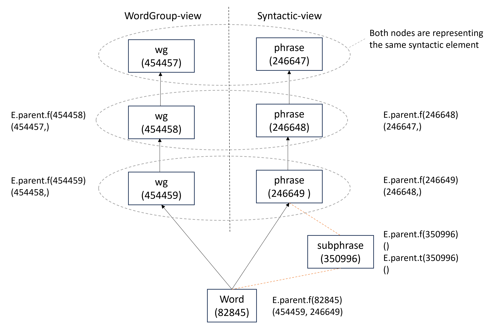

<a name="start"></a>
<div class="hidden-content">
<a href="../transcription.md">Transcription</a> | <a href="README.md#start">Features</a> | <a href="../viewtypes.md#start">Viewtypes</a> | <a href="../textformats.md#start">Textformats</a> |  <a href="../syntaxtrees.md#start">Syntaxtrees</a> | <a href="../tutorial/README.md#start">Tutorial</a>  | <a href="../about.md#start">About</a>
</div>

# Nestle 1904 GNT - Feature: parent

Feature group | Feature type | Data type | Available for node types | Used by viewtypes
---  | --- | --- | --- | ---
[`Relational`](featuresbygroup.md#relational-features) | [`Edge`](featuresbyfeaturetype.md#edge-features) | [`String`](featuresbydatatype.md#string-datatype)  | [`word`](featuresbynodetype.md#word-nodes) [`wg`](featuresbynodetype.md#wordgroup-nodes) [`Sentence`](featuresbynodetype.md#sentence-nodes) [`verse`](featuresbynodetype.md#verse-nodes) [`chapter`](featuresbynodetype.md#chapter-nodes) [`Book`](featuresbynodetype.md#book-nodes) [`phrase`](featuresbynodetype.md#phrase-nodes) [`subphrase`](featuresbynodetype.md#subphrase-nodes) | [`syntax-view`](../syntax-view.md#start) [`wg-view`](../wg-view.md#start)
 
## Feature description

The `parent` feature indicates the edge between a node and its parent node. It can be used to query upon hierarchical relationships within the syntactic structure.

## Feature value

Any of the following:
   * Zero node value - node has no parent
   * One node value - node has one parent
   * Two node values - node has two parents


## Notes

Usually, any node would have just one parent. However, in our implementation, word nodes can have two parents due to the inclusion of both the 'wg-view' and the 'syntax-view' within a single database.

### Example Query
The following query demonstrates a typical use of this feature, ensuring wg2 is a child of wg1 and w1 is a child of wg1:

```python
Query = '''
wg1:wg type=modifier-scope
  w1:word lemma=ἐλπίς
  wg2:wg rule=DetNP
wg2 -parent> wg1
w1 -parent> wg1
'''
Results = A.search(Query)
 0.24s 6 results
```
Part of the results is shown below in the (default) [`syntax-view`](../syntax-view.md#start):



The same section is shown in the [`wg-view`](../wg-view.md#start):



The parent-child relation can be checked using the following functions with the node numbers printed above:

```python
 E.parent.f(82843)
   (454458, 246648)
 F.otype.v(246648)
   'phrase'
 F.otype.v(454458)
   'wg'
```

This output shows the word node has two parents: a `phrase` and a `wg` node. This dual parent relation is a consequence of implementing two view types:
   * [`syntax-view`](../syntax-view.md#start) (default): Presents the syntax tree using linguistic terms like phrases and clauses.
   * [`wg-view`](../wg-view.md#start): Presents the syntax tree in a more agnostic manner by means of word groups.


The following image shows how the `parent` feature operates on various node types. The node type 'subphrase' is not part of this parent-child relation schema.



Feature parent can also be used to identify the child node(s) by calling function E.parent.t(...):
```python
E.parent.f(246649)
  (246648,)
```

See also the related feature [sibling](sibling.md#start).

## Source description

This feature is calculated during dataset creation.

---
#### *Browse all features by [name](featuresbyname.md#start), [node type](featuresbynodetype.md#start), [data type](featuresbydatatype.md#start), [feature group](featuresbygroup.md#start) or [feature type](featuresbyfeaturetype.md#start).*

