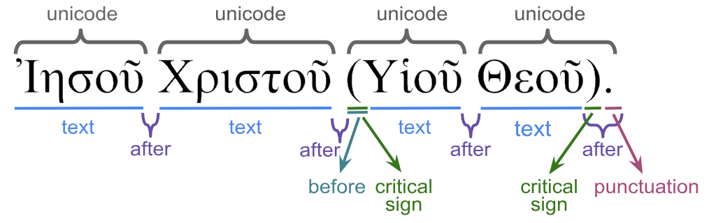

<a href="../transcription.md">Transcription</a> | <a href="README.md#start">Features</a> | <a href="../viewtypes.md#start">Viewtypes</a> | <a href="../textformats.md#start">Textformats</a> |  <a href="../syntaxtrees.md#start">Syntaxtrees</a> | <a href="../../tutorial/README.md#start">Tutorial</a> | <a href="../usecases/README.md#start">Usecases</a> | <a href="../about.md#start">About</a>

# Nestle 1904 GNT - Feature: punctuation

Feature group | Feature type | Data type | Available for node types | Used by viewtypes
---  | --- | --- | --- | ---
[`Orthograpic`](featuresbygroup.md#orthograpic-features) | [`Node`](featuresbyfeaturetype.md#node-features) | [`string`](featuresbydatatype.md#string-datatype) | [`word`](featuresbynodetype.md#word-nodes) [`subphrase`](featuresbynodetype.md#subphrase-nodes) [`phrase`](featuresbynodetype.md#phrase-nodes) | [`syntax-view`](../syntax-view.md#start) [`wg-view`](../wg-view.md#start)

## Feature description 

This feature includes either a regular space character or a punctuation mark followed by a regular space character, occurring after a word.

This feature is also populated for `phrase` or `subphrase`, but only if they consist of just one `word` node.

## Feature values 

Value | Description | Unicode codepoint | Frequency1
---  |  --- | --- | ---
`&nbsp` | Space | [`&#32`](https://www.codetable.net/decimal/32)  |  238522
`, ` | Comma |  [`&#44`](https://www.codetable.net/decimal/44)   | 18878
`. ` | Full Stop | [`&#46`](https://www.codetable.net/decimal/46) | 11408
`· ` | Midle Dot | [`&#183`](https://www.codetable.net/decimal/183) | 4710
`; ` | Semicolon | [`&#59`](https://www.codetable.net/decimal/59) | 1938
`,— ` |  | 36
`— ` |  | 14
`). ` | | 12
`.]] ` | | 8
`·— ` | | 8
etc.. | | another 11

1 Frequency figures are listed for word nodes only.

## Notes

See also the following related features:
   * [after](after.md#start): All material found after a word.
   * [before](before.md#start): All material found before a word.
   * [criticalsign](criticalsign.md#start): Text-critical signs.
   * [text](text.md#start): Word without punctuations and text-critical signs.
   * [translit](translit.md#start): Transliteration of the word surface texts.
   * [unaccent](unaccent.md#start): word without accents and diacritical markers.
   * [unicode](unicode.md#start): Unicode presentation including all material before and after word.

The following image shows the relation between these features.

The following [text-formating options](../textformats.md#start) are defined in this dataset using this feature:
<pre>
  A.showFormats()
     format              level    template
     lex-orig-plain      word     {lemma}{punctuation}
     lex-translit-plain  word     {lextranslit}{punctuation}
     text-orig-full      word     {before}{text}{after}
     text-orig-plain     word     {text}{punctuation}
     text-translit-plain word     {translit}{punctuation}
     text-unaccent-plain word     {unaccent}{punctuation}
</pre>

## Source description

Calculated from the from XML attribute `after` of tag `w` (word).

---
##### *Browse all features by [node type](featuresbynodetype.md#start), [data type](featuresbydatatype.md#start), [feature group](featuresbygroup.md#start) or [feature type](featuresbyfeaturetype.md#start).*

