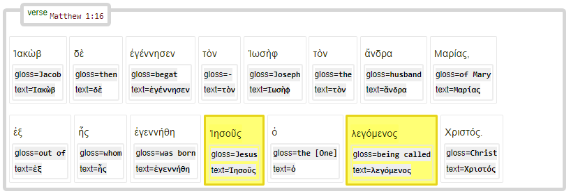

<a href="../transcription.md">Transcription</a> | <a href="README.md#start">Features</a> | <a href="../viewtypes.md#start">Viewtypes</a> | <a href="../textformats.md#start">Textformats</a> |  <a href="../syntaxtrees.md#start">Syntaxtrees</a> | <a href="../../tutorial/README.md#start">Tutorial</a> | <a href="../usecases/README.md#start">Usecases</a> | <a href="../about.md#start">About</a>

# Nestle 1904 GNT - Feature: subjref

Feature group | Feature type | Data type | Available for node types | Used by viewtypes
---  | --- | --- | --- | ---
[`Syntactic`](featuresbygroup.md#syntactic-features) | [`Edge`](featuresbyfeaturetype.md#edge-features) | [`string`](featuresbydatatype.md#string-datatype)  | [`word`](featuresbynodetype.md#word-nodes)  | [`syntax-view`](../syntax-view.md#start) [`wg-view`](../wg-view.md#start)

## Feature description

Subject reference to one or more nodes.

This feature is also populated for `phrase` or `subphrase`, but only if they consist of just one `word` node.

## Feature values

`word` node values.

## Notes

The "Subject Reference" feature is implemented as an edge feature within the data structure. Its usage can be seen in the following example, where the feature is applied in a structured query. The following examples shows two nodes being reported:

<pre>
E.subjref.f(514)
  (524, 533)
</pre>

This snippet indicates that the node with identifier 514 has a subject reference connection to nodes 524 and 533.

To demonstrate the practical application of this feature, consider the following query example:

<pre>
SubQuery = '''
clause
  w1:word 
  w2:word 
  w1 -subjref> w2
'''
SubResults = PLAY.search(SubQuery)
  0.17s 7755 results
</pre>

This query illustrates how to retrieve relationships where one word (w1) has a subject reference to another word (w2).
One example syntactical tree:

See also related feature [subjrefspec](subjrefspec.md#start).

## Source description

Based upon (optional) XML attribute `subjref` of tag `w` (word).

---
#### *Browse all features by [name](featuresbyname.md#start), [node type](featuresbynodetype.md#start), [data type](featuresbydatatype.md#start), [feature group](featuresbygroup.md#start) or [feature type](featuresbyfeaturetype.md#start).*
