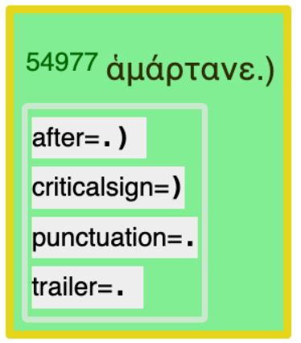

<a href="../transcription.md">Transcription</a> | <a href="README.md#start">Features</a> | <a href="../viewtypes.md#start">Viewtypes</a> | <a href="../textformats.md#start">Textformats</a> |  <a href="../syntaxtrees.md#start">Syntaxtrees</a> | <a href="../../tutorial/README.md#start">Tutorial</a>  | <a href="../about.md#start">About</a>

# Nestle 1904 GNT - Feature: trailer

Feature group |Feature type | Data type | Available for node types | Used by viewtypes
---  | --- | --- | --- | ---
[`Orthograpic`](featuresbygroup.md#orthograpic-features) | [`Node`](featuresbyfeaturetype.md#node-features) | [`String`](featuresbydatatype.md#string-datatype) | [`word`](featuresbynodetype.md#word-nodes) [`subphrase`](featuresbynodetype.md#subphrase-nodes) [`phrase`](featuresbynodetype.md#phrase-nodes) | [`syntax-view`](../syntax-view.md#start) [`wg-view`](../wg-view.md#start) 

## Feature description

This feature contains all material after the end of the word (excluding critical signs). This includes punctuations and trailing space.

## Feature Values

For [`word`](featuresbynodetype.md#word-nodes) nodes (used in [`syntax-view`](../syntax-view.md#start) and  [`wg-view`](../wg-view.md#start)):

Value| Description | Unicode codepoint(s) | Frequency
---|---|---|---
` ` | space | [`&#32`](https://www.codetable.net/decimal/32) |119270
`, ` | Comma & space | [`&#44`](https://www.codetable.net/decimal/44) & [`&#32`](https://www.codetable.net/decimal/32)| 9462
`. ` | Full Stop & space | [`&#46`](https://www.codetable.net/decimal/46) & [`&#32`](https://www.codetable.net/decimal/32)| 5717
`· ` | Midle Dot & space | [`&#183`](https://www.codetable.net/decimal/183) & [`&#32`](https://www.codetable.net/decimal/32)| 2359
`; ` | Semicolon & space | [`&#59`](https://www.codetable.net/decimal/59) & [`&#32`](https://www.codetable.net/decimal/32) | 971 

For [`phrase`](featuresbynodetype.md#phrase-nodes) nodes (used in [`syntax-view`](../syntax-view.md#start)):

Value| Description | Unicode codepoint(s) | Frequency
---|---|---|---
` ` | space | [`&#32`](https://www.codetable.net/decimal/32) | 37665
`,` | Comma & space | [`&#44`](https://www.codetable.net/decimal/44) & [`&#32`](https://www.codetable.net/decimal/32)| 3903
`.` | Full Stop & space | [`&#46`](https://www.codetable.net/decimal/46) & [`&#32`](https://www.codetable.net/decimal/32)| 2731
`·` | Midle Dot & space | [`&#183`](https://www.codetable.net/decimal/183) & [`&#32`](https://www.codetable.net/decimal/32)| 1189
`;` | Semicolon & space | [`&#59`](https://www.codetable.net/decimal/59) & [`&#32`](https://www.codetable.net/decimal/32)| 589

For [`subphrase`](featuresbynodetype.md#subphrase-nodes) nodes (used in [`syntax-view`](../syntax-view.md#start)):

Value| Description | Unicode codepoint(s) | Frequency
---|---|---|---
` ` | space | [`&#32`](https://www.codetable.net/decimal/32) | 119270
`,` | Comma | [`&#44`](https://www.codetable.net/decimal/44) [`&#32`](https://www.codetable.net/decimal/32)| 9462
`.` | Full Stop & space | [`&#46`](https://www.codetable.net/decimal/46) & [`&#32`](https://www.codetable.net/decimal/32)| 5717
`·` | Midle Dot & space | [`&#183`](https://www.codetable.net/decimal/183) & [`&#32`](https://www.codetable.net/decimal/32)| 2359
`;` | Semicolon & space | [`&#59`](https://www.codetable.net/decimal/59) & [`&#32`](https://www.codetable.net/decimal/32) | 971

## Notes

The following image shows the features describing the material found after a word.

The following set of features describe the full surface text:
   * [after](after.md#start): All material found after a word (including critical signs).
   * [before](before.md#start): All material found before a word.
   * [criticalsign](criticalsign.md#start): Text-critical signs.
   * [text](text.md#start): Word without punctuations and text-critical signs.
   * trailer (this feature): All material found after a word (excluding text-critical signs).
   * [translit](translit.md#start): Transliteration of the word surface texts.
   * [punctuation](punctuation.md#start): the punctuation character found after a word.
   * [unaccent](unaccent.md#start): word without accents and diacritical markers.
   * [unicode](unicode.md#start): Unicode presentation including all material before and after word.

The following image shows the relation between these features.

The following [text-formating options](../textformats.md#start) are defined in this dataset using this feature:
<pre>
  A.showFormats()
     format              level    template
     lex-orig-plain      word     {lemma}{punctuation}
     lex-translit-plain  word     {lextranslit}{punctuation}
     text-orig-full      word     {before}{text}{after}
     text-orig-plain     word     {text}{punctuation}
     text-translit-plain word     {translit}{punctuation}
     text-unaccent-plain word     {unaccent}{punctuation}
</pre>

## Source description

Calculated from the from XML attribute `after` of tag `w` (word).

---
#### *Browse all features by [name](featuresbyname.md#start), [node type](featuresbynodetype.md#start), [data type](featuresbydatatype.md#start), [feature group](featuresbygroup.md#start) or [feature type](featuresbyfeaturetype.md#start).*
