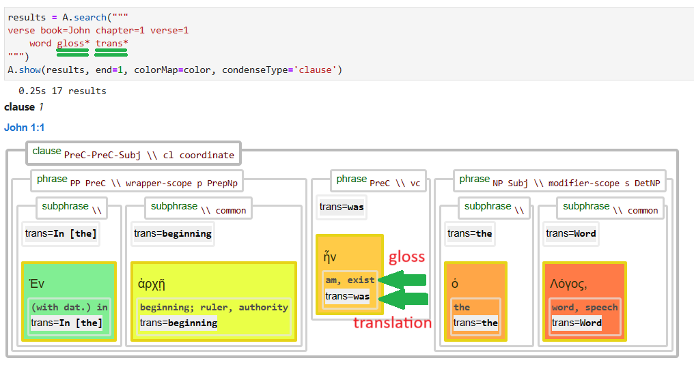

<a href="../transcription.md">Transcription</a> | <a href="README.md#start">Features</a> | <a href="../viewtypes.md#start">Viewtypes</a> | <a href="../textformats.md#start">Textformats</a> |  <a href="../syntaxtrees.md#start">Syntaxtrees</a> | <a href="../../tutorial/README.md#start">Tutorial</a> | <a href="../usecases/README.md#start">Usecases</a> | <a href="../about.md#start">About</a>

# Nestle 1904 GNT - Feature: trans

Feature group | Feature type | Data type | Available for node types | Used by viewtypes
---  | --- | --- | --- | ---
[`Lexical`](featuresbygroup.md#lexical-features) | [`Node`](featuresbyfeaturetype.md#node-features) | [`string`](featuresbydatatype.md#string-datatype)  | [`word`](featuresbynodetype.md#word-nodes) [`subphrase`](featuresbynodetype.md#subphrase-nodes) [`phrase`](featuresbynodetype.md#phrase-nodes) | [`syntax-view`](../syntax-view.md#start) [`wg-view`](../wg-view.md#start) 

## Feature description

The `trans` feature provides an English translation based on the [Berean Interlinear Bible](https://berean.bible/). It offers a word-for-word translation of the Greek text, focusing on direct correspondence between Greek and English words while making adjustments for English grammar and punctuation to enhance readability.

This feature prioritizes literal accuracy over idiomatic or contextual fluency. This feature is also populated for `phrase` or `subphrase`, but only if they consist of just one `word` node.

## Notes

See also the related feature [gloss](gloss.md#start) which contains the English translation of the lexeme. The following image shows their relation:

## Source description

The `trans` feature is based on the XML attribute `gloss` of the `w` (word) tag.

The source of this data is the [Berean Interlinear Bible](https://interlinearbible.com/). The Berean Bible and Majority Bible texts were officially placed into the public domain as of April 30, 2023.

---
###### *Browse all features by [node type](featuresbynodetype.md#start), [data type](featuresbydatatype.md#start), [feature group](featuresbygroup.md#start) or [feature type](featuresbyfeaturetype.md#start).*
