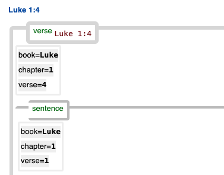

<a href="../transcription.md">Transcription</a> | <a href="README.md#start">Features</a> | <a href="../viewtypes.md#start">Viewtypes</a> | <a href="../textformats.md#start">Textformats</a> |  <a href="../syntaxtrees.md#start">Syntaxtrees</a> | <a href="../tutorial/README.md#start">Tutorial</a>  | <a href="../about.md#start">About</a>

# Nestle 1904 GNT - Feature: verse 

Feature group | Feature type | Data type | Available for node types | Used by viewtypes
---  | --- | --- | --- | ---
[`Sectional`](featuresbygroup.md#sectional-features) | [`Node`](featuresbyfeaturetype.md#node-features) | [`Integer`](featuresbydatatype.md#integer-datatype) | [`word`](featuresbynodetype.md#word-nodes) [`sentence`](featuresbynodetype.md#sentence-nodes) [`group`](featuresbynodetype.md#group-nodes)  [`wg`](featuresbynodetype.md#wordgroup-nodes) [`clause`](featuresbynodetype.md#clause-nodes) [`phrase`](featuresbynodetype.md#phrase-nodes) [`subphrase`](featuresbynodetype.md#subphrase-nodes) [`verse`](featuresbynodetype.md#verse-nodes) | [`syntax-view`](../syntax-view.md#start) [`wg-view`](../wg-view.md#start) 

## Feature description

This feature indicates a verse number within a chapter.  

## Feature value

The value of this feature is an integer representing a verse number. The specific reference depends on the node type:
 - `verse` node: The value points to the verse itself.
 - `word` node: The value indicates the verse to which this word belongs.
 - All other node types: The value represents the verse number where this item begins.

To illustrate, consider the first sentence in the Gospel of Luke, which spans four verses. The following image shows part of verse 4, demonstrating how this feature works:

## Notes

When using verse numbers inside a script, it is not save to assume verse number within a chapter are sequential without gaps. The folling is a list of 'missing' verses: Matthew 17:21; 18:1;  23:14, Mark 7:16;  9:44&46; 11:26; 15:28, Luke 17:36;  23:17,  Acts 8:37; 15:34;  24:7;  28:29,  Romans 16:24, and a 'gap' after Mark 16:20 until verse 99.

## Source description

This feature is calculated from the XML attribute `ref` of the `w` (word) tag.

---
#### *Browse all features by [name](featuresbyname.md#start), [node type](featuresbynodetype.md#start), [data type](featuresbydatatype.md#start), [feature group](featuresbygroup.md#start) or [feature type](featuresbyfeaturetype.md#start).*
