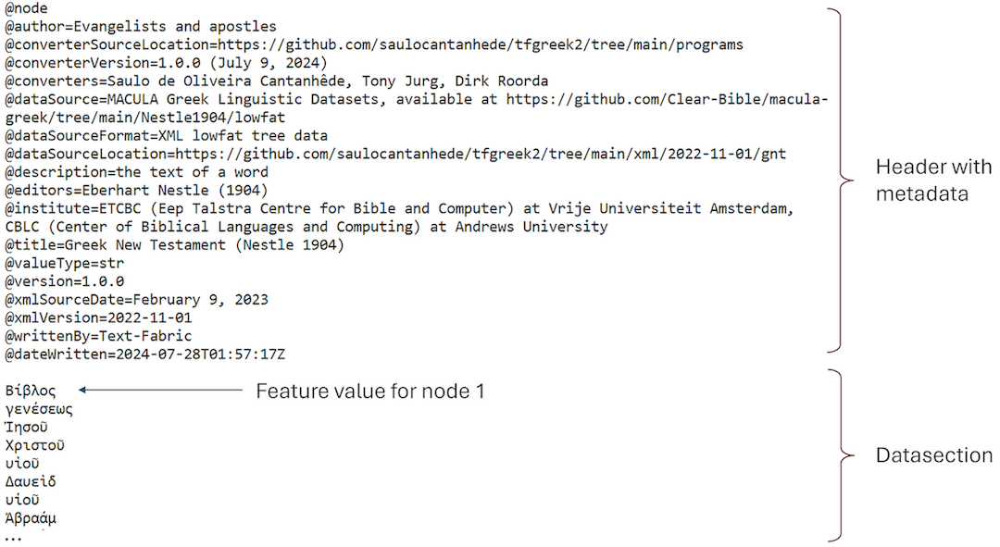
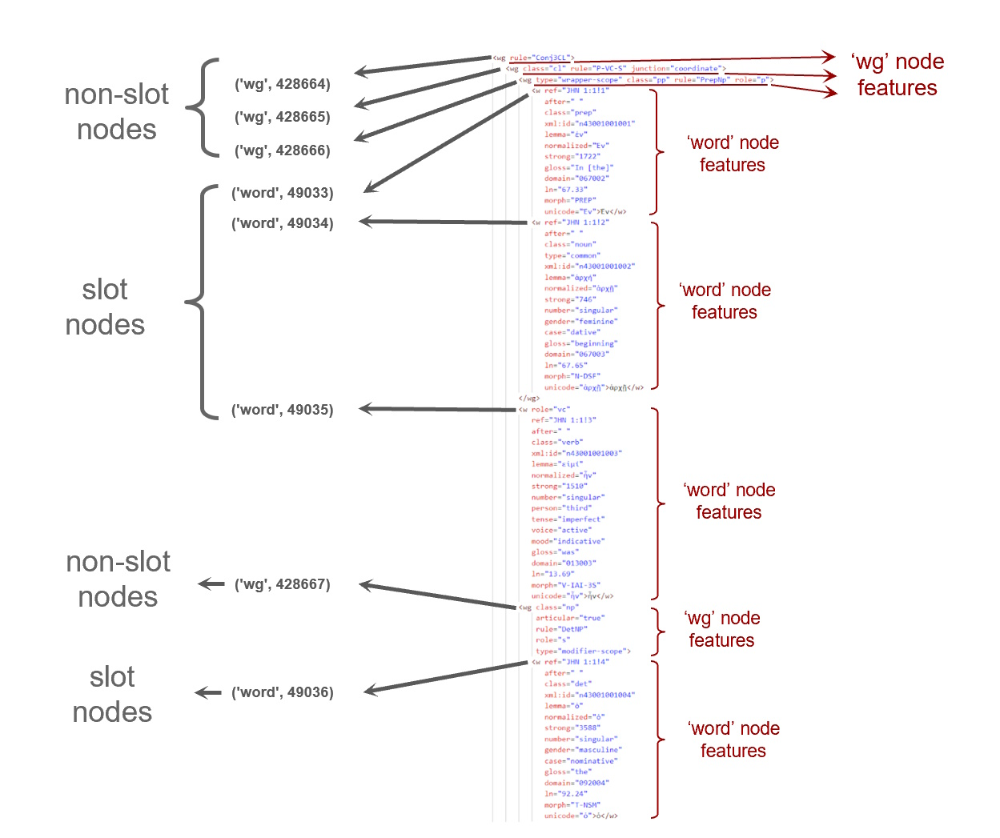

Transcription | <a href="features/README.md#start">Features</a> | <a href="viewtypes.md#start">Viewtypes</a> | <a href="textformats.md#start">Textformats</a> |  <a href="syntaxtrees.md#start">Syntaxtrees</a> | <a href="tutorial/README.md#start">Tutorial</a> | <a href="about.md#start">About</a>

# Nestle 1904 GNT - Transcription

This page offers a brief overview of the transcription of the Nestle 1904 Greek New Testament (GNT) corpus, detailing how the original Greek texts is available in Text-Fabric format for digital accessibility, and outlines the types of linguistic annotations that are available.

## The database organization

A main design consideration during development of this database was achieving a high level of compatibility with the [Bible Online Learner (Bible OL)](https://learner.bible/), which utilizes the Nestle 1904 as its base text. A second requirement was that this database should wherever possible mimick the [Biblia Hebraica Stuttgartensia Amstelodamensis (BHSA)](https://etcbc.github.io/bhsa/), the ETCBC implementation of the Hebrew Bible, in terms of user experience, nomenclature and data presentation. 

Text-Fabric, true to its name, implements a concepts of 'warp' and 'weft', inspired by textile weaving, to represent its data. The 'warp' denotes the foundational structured data, encompassing linguistic annotations like words, and phrases, while the 'weft' refers to the additional layers of information, known as features. These features encompass linguistic data, annotations, and metadata, seamlessly woven into the 'warp' data, resulting in a strict separation between structure and content. This approach enables Text-Fabric to efficiently handle complex linguistic datasets with versatility.

### Nodes and slots

In Text-Fabric, the text of a corpus is represented as a sequence of slots, which are the smallest linguistic units, implemented as 'nodes', each identified by a unique number. This database organization, often referred to as tokenization, can be based on any unit: ranging from symbols (e.g., on an Akkadian clay tablet), individual letters (e.g., from the Dead Sea Scrolls, where the text might lack letters and words, or contain unintelligible parts), to individual words. In this Text-Fabric database, tokenization is based on individual words. Therefore, this database uses 'word' nodes as its slot type, which implies that the smallest linguistic unit that can be queried is a 'word'. This approach is logical from both exegetical and linguistic perspectives, particularly since the Nestle 1904 corpus is a synthetic text without incomplete or 'missing' words due to damaged manuscripts.

### Features 

In Text-Fabric, the concept of 'feature' refers to the mapping of a node (e.g., the 'word' node) to its associated attributes with their values (e.g. in case of the 'word' node: the text itself and other details like gender, number or mood). Each node types like 'word', 'wg' (word groups), 'sentence', or 'verse' in this dataset has its own set of associated 'features' providing additional information specific to that nodetype.

Since this Text-Fabric database contains well over 50 features, four listings are provided, each based on a different types of grouping in order to provide a structured overview:
* [Grouped by feature group](features/featuresbygroup.md#start): e.g., [`Orthographic`](features/featuresbygroup.md#orthograpic-features), [`Syntactic`](features/featuresbygroup.md#syntactic-features).
* [Grouped by node type](features/featuresbynodetype.md#start): e.g., [`word`](features/featuresbynodetype.md#word-nodes), [`clause`](features/featuresbynodetype.md#clause-nodes).
* [Grouped by data type](features/featuresbydatatype.md#start): e.g., [`str`](features/featuresbydatatype.md#string-datatype), [`int`](features/featuresbydatatype.md#integer-datatype). The python datatype is relevant when building queries or when processing the data.
* [Grouped by feature type](features/featuresbyfeaturetype.md#start): e.g., [`node`](features/featuresbyfeaturetype.md#node-features), [`edge`](features/featuresbyfeaturetype.md#edge-features).

Additionally, an alphabetical list of feature names can be found [here](features/featuresbyname.md#start).

### Views

The concept of [viewtypes](viewtypes.md#start) is important to this dataset. This database offers the users two distinct viewtypes that can be invoked for representing syntax trees:
   * [syntax-view](syntax-view.md#start) (default): present syntax trees in linguistic terms like phrases and clauses.
   * [wg-view](wg-view.md#start): present syntax trees in agnostic terms like word groups.

### Textformats

Text-Fabric allows the corpus text to be formatted in different ways, depending on the intended use. This Text-Fabric database has a number of formats defined, which are discussed in the section [textformats](textformats.md#start).

## Implementation note

### General

Each Text-Fabric dataset release (version) stores all data related to the corpus base text and its associated features in a single directory '/tf/{version}'. The data for each individual feature is stored in plain Unicode text files with the '.tf' extension, with the filename matching the Text-Fabric feature name. These feature files are readable using any ordinary text editor. Each file starts with a header section containing metadata, indicated by lines starting with the '@' symbol, followed by a blank line. This is followed by lines with feature data, where the value stored on a given line 'n' is the value of that feature for node 'n'. Moreover, Text-Fabric uses some data optimizations to handle long sequences of empty lines and long sequences of equal feature values. The following image shows the content of the .tf file for the feature 'text,' which is associated with the node type 'word':

### Mapping of LowFat XML source to TF dataset

This is a general overview of how the LowFat XML source data maps to Text-Fabrics dataset.

*   TF *«slot» nodes* correspond to in XLM element content;
*   TF *node types* generaly correspond to XML *element names (tags)*;
*   TF *non-«slot» nodes* correspond to XML *elements in the source*;
*   TF *node features* generaly correspond to XML *attributes*, albeit some with updated values;
*   TF *edge features* correspond to *relationships* between XLM elements.

See also the following image mapping LowFat XML to TF data:

