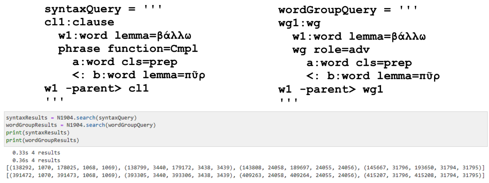
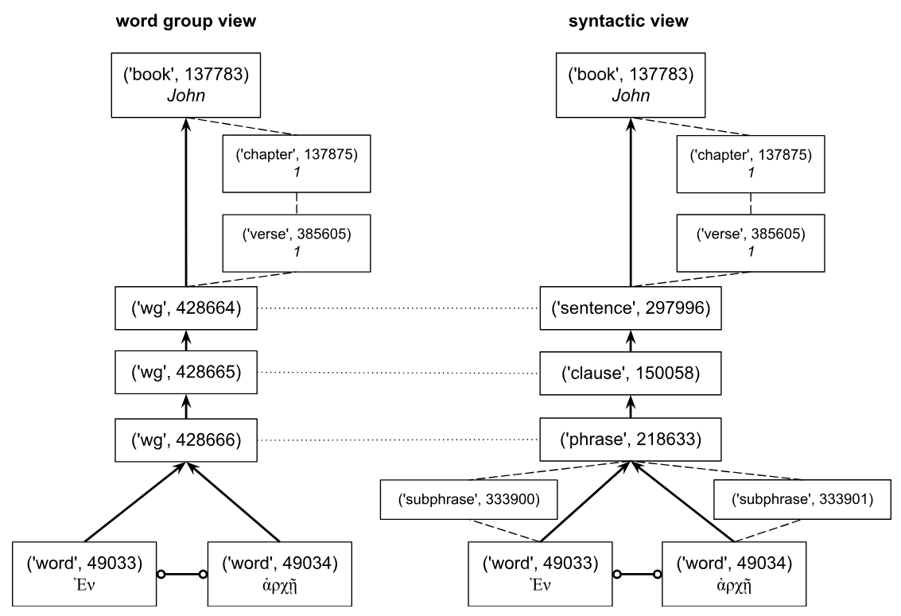

<a href="transcription.md">Transcription</a> | <a href="features/README.md#start">Features</a> | <a href="additions/README.md#start">Additions</a> | Viewtypes | <a href="textformats.md#start">Textformats</a> |  <a href="syntaxtrees.md#start">Syntaxtrees</a> | <a href="tutorial/README.md#start">Tutorial</a> | <a href="about.md#start">About</a>

# Nestle 1904 GNT - Viewtypes

## The viewtypes

This Text-Fabric database offers its users two distinct view types to display the [syntaxtrees](syntaxtrees.md#start). This is possible due to a partial data duplication using dedicated node types that are associated with each of these view types. While most features are associated with both view types, some features are specifically tuned to a particular view type, for example, by using matching or dedicated nomenclature. The association between node type and view type is shown in the following table.

Viewtype | Display syntax tree | Invocation | Associated node types | 
--- | --- | --- | ---
[`wg-view`](wg-view.md#start) | In agnostic terms like word groups | A.viewtype('wg') |  [`wg`](features/featuresbynodetype.md#wordgroup-nodes) 
[`syntax-view`](syntax-view.md#start) | In linguistic terms like phrases and clauses | A.viewtype('syntax') | [`subphrase`](features/featuresbynodetype.md#subphrase-nodes) [`phrase`](featuresbynodetype.md#phrase-nodes) [`clause`](features/featuresbynodetype.md#clause-nodes) [`group`](featuresbynodetype.md#group-nodes)

Note: the node types  [`word`](features/featuresbynodetype.md#word-nodes), [`sentence`](features/featuresbynodetype.md#sentence-nodes), [`verse`](featuresbynodetype.md#verse-nodes), [`chapter`](features/featuresbynodetype.md#chapter-nodes), and [`book`](features/featuresbynodetype.md#book-nodes) are common for both views.

Note that it is also possible to reset the display and show all nodes by entering the the command A.viewtype('reset').

## User impact

The data duplication not only impacts the representation of syntax trees, controlled by setting the view type, but it also impacts the creation of queries. Although the Text-Fabric dataset provides access to all nodes and features at all times, it is important to formulate syntactic queries that match either one of these data structures. The following figure provides two functionally equivalent queries:

Both queries examine instances where 'fire' is thrown down, focusing on the preposition used by specifying 'prep' instead of a lexeme. These queries respectively search for clauses or word groups that contain the verb βάλλω ('to throw down')  and a complement phrase or adverbial word group with the lemma πῦρ ('fire'). Both queries yield the same verses (Matthew 3:10; 7:19, Mark 9:22, Luke 3:9) and words but return different tuple values. The differences arise from the query templates, differing only in the first and third lines ('clause' or 'phrase' vs. 'wg'), affecting the first and third tuple elements. Note that a tuple in Python is defined as an immutable, ordered collection of elements.

### Impact on using parent and sibling feature 

Understanding the distinctions between these two views is especialy important when building queries that involve parent-child relations. E.g. when using the edge features [parent](features/parent.md#start) and [sibling](features/sibling.md#start). See following image for details:

This image compares the parent (arrows) and sibling features (connector with circle) for the first phrase of the book of John (John 1:1) for the [`wg-view`](wg-view.md#start) and the [`syntax-view`](syntactic-view.md#start) for the data. The parent feature for a specific node can be obtained using *E.parent.f(node)* and the sibling feature can be calculated using *E.sibling.b(node)*, where node stands for the number of the node. The direction of the arrow indicates the parent node of a given node. The dotted lines indicate that the `wg` nodes share the same data as the [`sentence`](features/featuresbynodetype.md#sentence-nodes), [`clause`](features/featuresbynodetype.md#clause-nodes), and [`phrase`](features/featuresbynodetype.md#phrase-nodes). The [`subphrase`](features/featuresbynodetype.md#subphrase-nodes), [`verse`](features/featuresbynodetype.md#verse-nodes), and [`chapter`](features/featuresbynodetype.md#chapter-nodes) nodes are not nested in the calculation of the parent and sibling features.

## Matching table

wg-view |syntax-view
---|---
feature [cls](features/cls.md#start) | feature [typ](features/typ.md#start)
&nbsp;&nbsp;&nbsp;&nbsp;&nbsp;&nbsp;adjp|&nbsp;&nbsp;&nbsp;&nbsp;&nbsp;&nbsp;AdjP
&nbsp;&nbsp;&nbsp;&nbsp;&nbsp;&nbsp;advp|&nbsp;&nbsp;&nbsp;&nbsp;&nbsp;&nbsp;AdvP
&nbsp;&nbsp;&nbsp;&nbsp;&nbsp;&nbsp;np|&nbsp;&nbsp;&nbsp;&nbsp;&nbsp;&nbsp;NP
&nbsp;&nbsp;&nbsp;&nbsp;&nbsp;&nbsp;vp|&nbsp;&nbsp;&nbsp;&nbsp;&nbsp;&nbsp;VP
feature [typems](features/typems.md#start")|feature [typ](features/typ.md#start)
&nbsp;&nbsp;&nbsp;&nbsp;&nbsp;&nbsp;conjugated-wg|&nbsp;&nbsp;&nbsp;&nbsp;&nbsp;&nbsp;conjuncted
&nbsp;&nbsp;&nbsp;&nbsp;&nbsp;&nbsp;apposition-group|&nbsp;&nbsp;&nbsp;&nbsp;&nbsp;&nbsp;apposition
feature [role](features/role.md#start)|feature [function](features/function.md#start)
&nbsp;&nbsp;&nbsp;&nbsp;&nbsp;&nbsp;io|&nbsp;&nbsp;&nbsp;&nbsp;&nbsp;&nbsp;Cmpl
&nbsp;&nbsp;&nbsp;&nbsp;&nbsp;&nbsp;o|&nbsp;&nbsp;&nbsp;&nbsp;&nbsp;&nbsp;Objc
&nbsp;&nbsp;&nbsp;&nbsp;&nbsp;&nbsp;o2|&nbsp;&nbsp;&nbsp;&nbsp;&nbsp;&nbsp;Objc
&nbsp;&nbsp;&nbsp;&nbsp;&nbsp;&nbsp;p|&nbsp;&nbsp;&nbsp;&nbsp;&nbsp;&nbsp;PreC
&nbsp;&nbsp;&nbsp;&nbsp;&nbsp;&nbsp;s|&nbsp;&nbsp;&nbsp;&nbsp;&nbsp;&nbsp;Subj
&nbsp;&nbsp;&nbsp;&nbsp;&nbsp;&nbsp;vc (for wg node)|&nbsp;&nbsp;&nbsp;&nbsp;&nbsp;&nbsp;Pred
&nbsp;&nbsp;&nbsp;&nbsp;&nbsp;&nbsp;v (for word node)|&nbsp;&nbsp;&nbsp;&nbsp;&nbsp;&nbsp;Pred
&nbsp;&nbsp;&nbsp;&nbsp;&nbsp;&nbsp;apposition|&nbsp;&nbsp;&nbsp;&nbsp;&nbsp;&nbsp;Appo

## Implementation notes

The implementation of this viewtype concept is done by adding a small portion of Python code to the app's [app.py](../app/app.py) file. The function of this file is to allows for functional enhancements which are required to effectively handle a corpus. The viewtypes are defined by adding labels to various node types, as specifies in the [config.yaml](../app/config.yaml) file. After loading all corpus data and creating the API object, [A.viewtype('syntax')](syntax-view.md#start) is called in order to set viewtype to 'syntax', making it the *de facto* default viewtype. 

If for some reason it is necessary to display all nodes, the command A.viewtype('reset') can be issued. This also resets all node labels to their definitions found in the [config.yaml](../app/config.yaml) file. 

