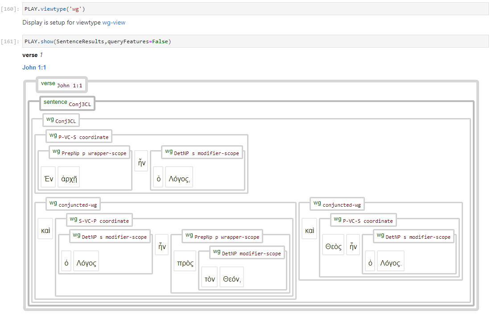

[`Transcription`](transcription.md#start) | [`Features`](features/README.md#start) | [`Viewtypes`](viewtypes.md#start) | [`Textformats`](textformats.md#start) | [`Syntaxtrees`](syntaxtrees.md#start) | [`Tutorial`](../tutorial/README.md#start) | [`Usecases`](usecases/README.md#start) |[`About`](about.md#start)

# Nestle 1904 GNT - Viewtype: wg-view

The wordgroup viewtype is a syntactically agnostic presentation in where clauses, phrases and subprases are not respresented by distinct nodestypes. They all map to the same node type, namely wordgroup, while their syntactic function and properties are reflected by their respective feature values.

Swithing to a specific viewtype can be done by entering A.viewtype(), which is specific to this dataset and automaticaly loaded upon invocation of the TF dataset.

Selecting a viewtype defines which nodes are displayed. The relation between node types and view types is shown in the following table.

Viewtype | Invocation | Associated node types | 
--- | --- | ---
`wg-view` (this view) | A.viewtype('wg') | [`wg`](featuresbynodetype.md#wordgroup-nodes) 
[`syntax-view`](syntax-view.md#start) | A.viewtype('syntax') | [`subphrase`](features/featuresbynodetype.md#subphrase-nodes) [`phrase`](features/featuresbynodetype.md#phrase-nodes) [`clause`](features/featuresbynodetype.md#clause-nodes) [`group`](features/featuresbynodetype.md#group-nodes)

Note: the node types  [`Word`](features/featuresbynodetype.md#word-nodes), [`Sentence`](features/featuresbynodetype.md#sentence-nodes), [`verse`](features/featuresbynodetype.md#verse-nodes), [`chapter`](features/featuresbynodetype.md#chapter-nodes), and [`Book`](features/featuresbynodetype.md#book-nodes)` are common for both views.

The following images show John 1:1 using the wg-view:

## Implementatation

The following actions are performed when the command A.viewtype('wg') is issued:
  * clause, phrase, subphrase, and group node types will be hidden.
  * The label for sentence nodes is updates with features matching a wordgroup view
  * The display parameter 'condensed' is set to True and 'queryFeatures' to False, respectively.

The code for the A.viewtype() command is located in file [app.py](../app/app.py).

